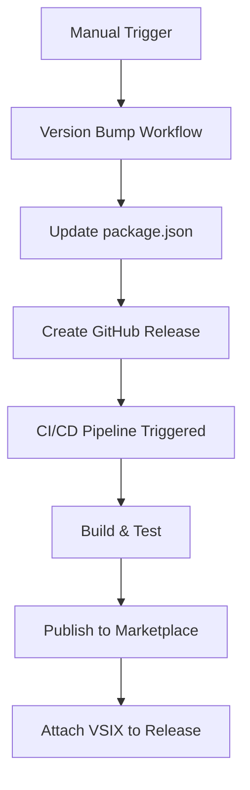

# 🚀 Complete Automation Flow Documentation

## 📋 Overview
This document explains the **100% automated** CI/CD pipeline for the TOON VS Code Extension.

## 🔄 Perfect Automation Flow

## 🎯 Three Workflows Explained

### 1. 🔧 **Version Bump & Release** (`version-bump.yml`)
**Trigger**: Manual workflow dispatch
**Purpose**: Increment version and create GitHub release

**Steps**:
1. Bump version (patch/minor/major)
2. Update CHANGELOG.md
3. Commit changes to main
4. Create GitHub release with tag
5. **Automatically triggers CI/CD pipeline**

### 2. 🏗️ **CI/CD Pipeline** (`ci-cd.yml`)
**Trigger**: GitHub releases (automatic from step 1)
**Purpose**: Build, test, and publish extension

**Jobs**:
- **build-and-test**: Compile, lint, test, package
- **publish-to-marketplace**: Publish to VS Code Marketplace

### 3. 🔒 **Security Monitor** (`security-monitor.yml`)
**Trigger**: Weekly + package.json changes
**Purpose**: Monitor for vulnerabilities

## 🎮 How to Use (One Command!)

### To Release a New Version:

1. Go to **GitHub Actions** tab
2. Click **"Version Bump and Release"**
3. Select version type: `patch` | `minor` | `major`
4. Click **"Run workflow"**

**That's it!** Everything else is automatic:
- ✅ Version bumped
- ✅ Release created  
- ✅ Extension built
- ✅ Published to marketplace
- ✅ VSIX attached to release

## 📊 Current State

- **Package Version**: 0.2.5 ✅
- **Marketplace Version**: 0.2.5 ✅  
- **Latest Release**: v0.2.7 ❌ (not published)
- **Status**: ⚠️ Releases 0.2.6 & 0.2.7 failed to publish

## 🔧 **IMMEDIATE ACTION REQUIRED**

The automation is now fixed, but we need to:

1. **Test the workflow** with a new release
2. **Verify VSCE_PAT secret** is properly set
3. **Ensure marketplace publishing works**

### Next Steps:
1. Use version-bump workflow to create v0.2.6
2. Monitor CI/CD pipeline closely
3. Verify marketplace gets updated
4. If successful, the flow is 100% working

## 🚨 Important Rules

### ❌ **DON'T DO**:
- Manual version changes in package.json
- Direct pushes to main for releases
- Manual marketplace publishing

### ✅ **DO**:
- Use version-bump workflow for releases
- Let automation handle everything
- Monitor workflow status

## 🔍 Workflow Triggers

| Workflow | Trigger | Purpose |
|----------|---------|---------|
| `version-bump.yml` | Manual dispatch | Create releases |
| `ci-cd.yml` | Release events | Build & publish |
| `security-monitor.yml` | Schedule/package changes | Security checks |

## 🎯 Success Criteria

A successful release flow shows:
1. ✅ Version Bump workflow completes
2. ✅ GitHub release created
3. ✅ CI/CD build-and-test passes
4. ✅ CI/CD publish-to-marketplace passes
5. ✅ Extension available on marketplace

## 🔧 Troubleshooting

### If CI/CD fails:
1. Check workflow logs in GitHub Actions
2. Verify VSCE_PAT secret is set
3. Ensure version matches release tag

### If marketplace publish fails:
1. Check VSCE_PAT token validity
2. Verify extension name/publisher
3. Check for version conflicts

## 🎉 Benefits

- **Zero Manual Work**: One click releases
- **No Mistakes**: Automated version management
- **Consistent**: Same process every time
- **Traceable**: Full audit trail in GitHub
- **Fast**: Complete release in ~2 minutes

---

**🔐 This is the OFFICIAL automation setup for vishalraut.vscode-toon**